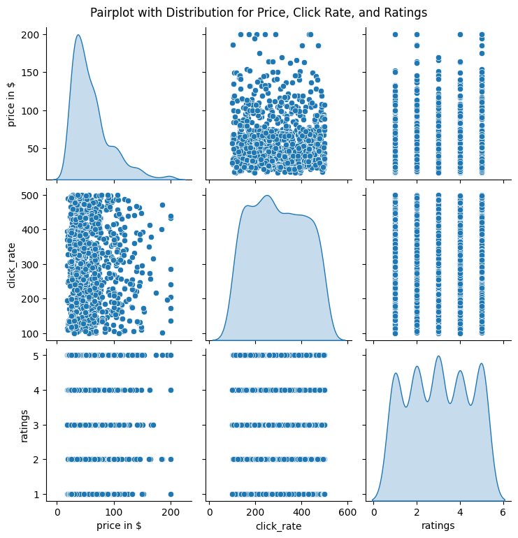
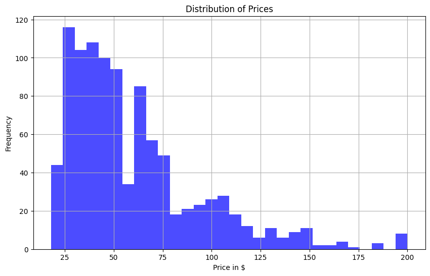
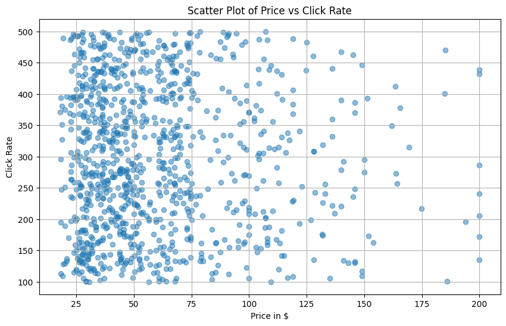

# Pinterest Fashion Dataset Analysis

This project is an extensive analysis of the Pinterest Fashion Dataset, focusing on data cleaning, exploratory data analysis, and building a retrieval-augmented generation system for product recommendation based on demographic data.

## Overview

The analysis is divided into two main parts:
1. **Data Analysis**: Involves cleaning, preprocessing, and exploratory data analysis (EDA) of the fashion dataset.
2. **Retrieval-Augmented Generation (RAG)**: Development of a system that utilizes user queries and demographic data to recommend fashion items.

## Installation

Before running the notebooks, ensure you have the following libraries installed:

## Part 1: Data Analysis

The initial phase involves loading the dataset into a pandas DataFrame, followed by cleaning and preprocessing:
- Handling missing values by imputation or removal.
- Converting data formats, e.g., changing the price column to numeric.

### Exploratory Data Analysis (EDA)

Key insights derived from the EDA include relationships between price, click-through rates, and ratings. Visualizations are created using histograms and scatter plots to understand these relationships better.

### Visualizations

Here are some of the key visualizations generated during the analysis:

**Histogram of Prices**  


**Histogram of Prices**  


**Scatter Plot of Click-through Rates vs. Ratings**  


## Part 2: Retrieval-Augmented Generation (RAG)

This section creates a function to retrieve products based on user queries, e.g., "best laptops under 500".

### Product Recommendation System

A simple RAG system is developed that takes a user’s age, gender, and location as input to recommend relevant products. The system utilizes either a built retrieval model or existing data to make these recommendations.

### Example Recommendations

**For a 35-year-old female in California interested in Shoes**
```bash
Based on your interests in Shoes and considering your location in California, we recommend Converse because it has a high rating of 5 stars and is priced at just $49.50, fitting well within your budget.
```
**For a 55-year-old male in California interested in Sunglasses**
```bash
Based on your interests in Sunglasses and considering your location in California, we recommend Burberry because it has a high rating of 5 stars and is priced at just $87.50, fitting well within your budget.
```

## Conclusion

This repository contains comprehensive analyses and a system capable of dynamically recommending products based on user preferences and demographics. The methodologies and technologies employed demonstrate effective data analysis and machine learning techniques in a real-world application.

